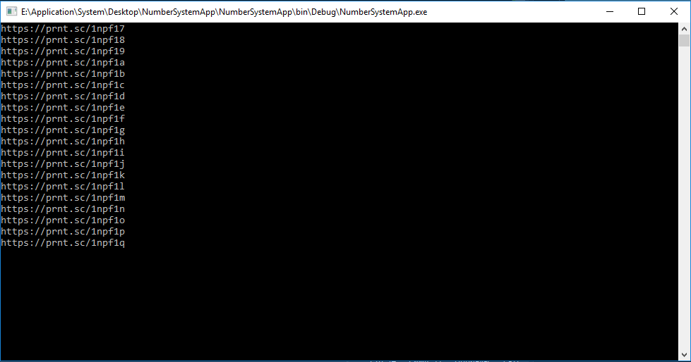

# Пример применения этой библиотеки
##### Формирование ссылок для просмотра скриншотов, сделанных с помощью _Lightshot_.

# Класс NumSystem
При инициализации класса можно указать систему счисления (алфавит).

### Поля класса
В поле **Dec** хранится десятичное представление текущего числа, которое можно изменить методом **setDecNumber()**.  
В поле **Abc** хранится десятичное представление текущего числа, которое можно изменить методом **setAbcNumber()**.  
  
//Abc -- название заданной системы счисления.  
**numbers** -- cтрока символов системы счисления Abc по порядку (алфавит).  
Например, для двоичной системы счисления он будет выглядеть так: "01".  
Указывается алфавит при инициализации объекта класса NumSystem.  

### Методы класса
**DecToAbc()** -- Представление десятичного числа в Abc системе счисления.  
**AbcToDec()** -- Представление Abc числа в десятичной системе счисления. Вызывает исключение с текстом "_UnknownSymbol_" при нахождении неизвестного символа.  
**isValidAbc()** -- Возвращает true если строка может являться значением в системе счисления Abc (полностью состоит из символов заданной системы счисления).  
**NextAbc()** -- Возвращает инкрементированное число в системе счисления Abc.  
**LastAbc()** -- Возвращает предыдущее число в Abc системе счисления, если оно не отрицательное. Иначе возвращает нуль в Abc системе счисления.  
**setDecNumber()** -- Устанавливает положительное десятичное число и его эквивалент в Abc системе счисления.   
**setAbcNumber()** -- Устанавливает число Abc и его эквивалент в десятичной системе счисления. От этого числа и возвращают следующее и предыдущее значения методы **NextAbc()** и **LastAbc()** соответственно.  